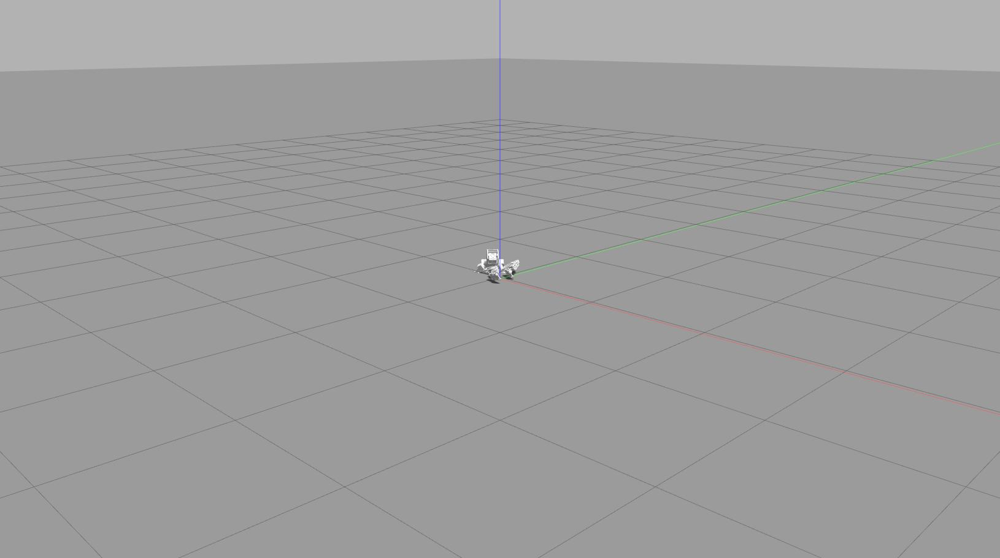
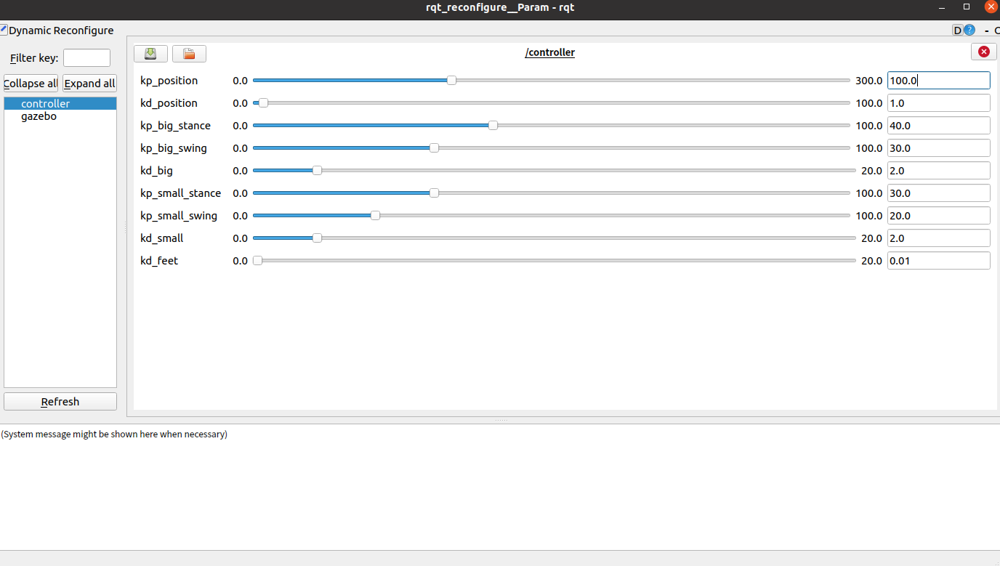
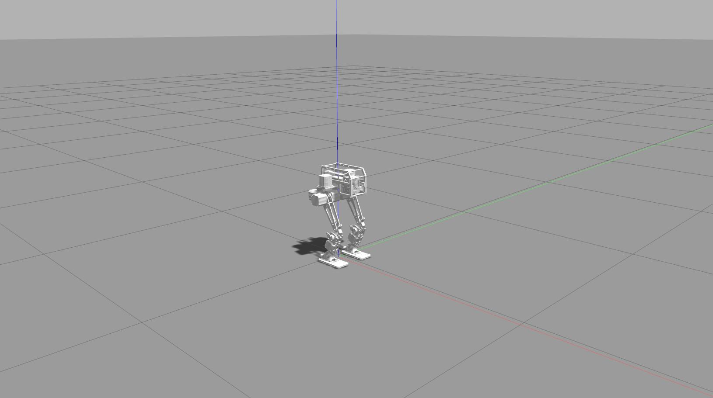
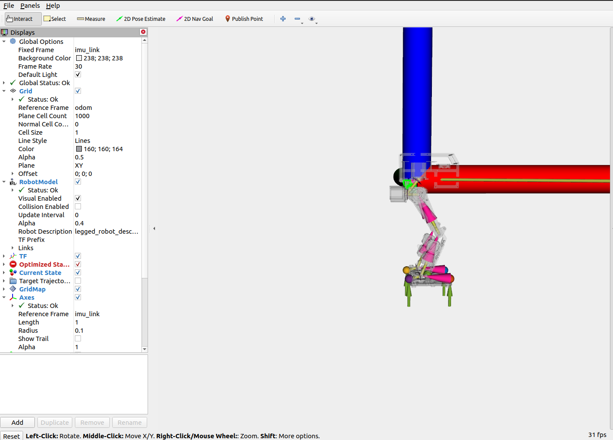
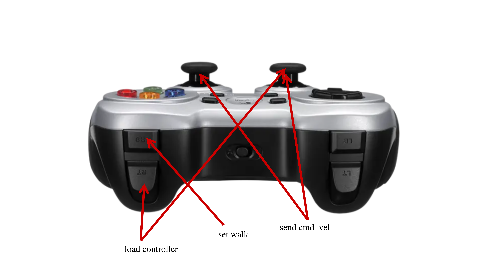
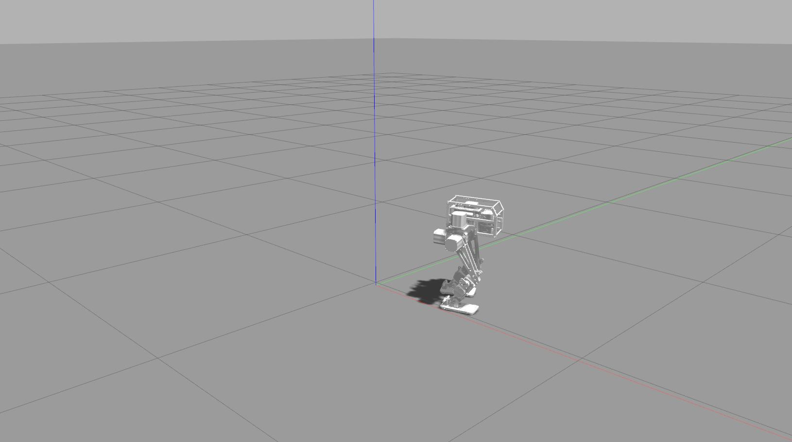

# livelybot_dynamic_control
An open source bipedal robot control framework, based on nonlinear MPC and WBC, adapted to high-end bipedal robots.[Page](https://github.com/HighTorque-Robotics/livelybot_dynamic_control.git)

## Installation

### Install dependencies

- [OCS2](https://leggedrobotics.github.io/ocs2/installation.html#prerequisites)

- [ROS1-Noetic](http://wiki.ros.org/noetic)

### OCS2

OCS2 is a huge monorepo; **DO NOT** try to compile the whole repo. You only need to compile `ocs2_legged_robot_ros` and
its dependencies following the step below.

1. You are supposed to clone the OCS2, pinocchio, and hpp-fcl as described in the documentation of OCS2.
   ```bash
   # Clone OCS2
   git clone https://github.com/leggedrobotics/ocs2.git
   # Clone pinocchio
   git clone --recurse-submodules https://github.com/leggedrobotics/pinocchio.git
   # Clone hpp-fcl
   git clone --recurse-submodules https://github.com/leggedrobotics/hpp-fcl.git
   # Clone ocs2_robotic_assets
   git clone https://github.com/leggedrobotics/ocs2_robotic_assets.git
   # Install dependencies
   sudo apt install liburdfdom-dev liboctomap-dev libassimp-dev
   ```
2. Compile the `ocs2_legged_robot_ros` package with [catkin tools](https://catkin-tools.readthedocs.io/en/latest/)
   instead of `catkin_make`. It will take you about ten minutes.

   ```bash
   catkin config -DCMAKE_BUILD_TYPE=RelWithDebInfo 
   catkin build ocs2_legged_robot_ros ocs2_self_collision_visualization
   ```
   Ensure you can command the ANYmal as shown in
   the [document](https://leggedrobotics.github.io/ocs2/robotic_examples.html#legged-robot) and below.
   
### Clone and Build

```shell

# Clone
mkdir -p <catkin_ws_name>/src
cd <catkin_ws_name>/src
git clone git@github.com:HighTorque-Robotics/livelybot_dynamic_control.git

# Build
cd <catkin_ws_name>
catkin init
catkin config -DCMAKE_BUILD_TYPE=RelWithDebInfo

# for different use build 
#  gazebo simulation 
catkin build legged_controllers legged_hunter_description legged_gazebo

#  Robot hardware 
catkin build legged_controllers legged_hunter_description legged_bridge_hw
```


## Quick Start
- Gazebo Simulation

[]()

### Simulation

Run the gazebo simulation and load the controller:

```shell
roslaunch legged_controllers one_start_gazebo.launch    
```

### Robot hardware

load the controller

```shell
roslaunch legged_controllers one_start_real.launch
```

***Notes:***
    After the user starts the simulation, the robot falls down in Gazebo.
 Gazebo
     First the user needs to set ***kp_position=100***, ***kd_position=1*** in rqt (need refresh) and reset the simulation by pressing ***Ctrl+Shift+R*** to make the robot stand up.  



## Gamepad Control

1. Start controller
```
Press the left joystick once，than push RT
```


Terminal appears "Successfully load the controller"

2. Switch to walking mode

```
push RB
```

3. Use the joystick to control robot movement

The following is a schematic diagram of the handle operation:




## Simulation Without Gamepad

Compilation: Only compile the following packages (and their dependencies), there's no need to compile the entire OCS2.

1. Gazebo Simulation
```bash
catkin build legged_controllers legged_hunter_description legged_gazebo
```

Execution: If you don't have a gamepad, you need to send the startup commands in order.

First, set ***kp_position=100*** in rqt and reset the simulation by pressing ***Ctrl+Shift+R*** to make the robot stand up. Then, send the following commands:

```bash
rostopic pub --once /load_controller std_msgs/Float32 "data: 1.23"
rostopic pub --once /set_walk std_msgs/Float32 "data: 1.23"
```

***Before /load_controller, there needs to be a node continuously sending /cmd_vel (10Hz is normal), and it should continue sending during the simulation. Once /cmd_vel stops, the robot may fall.***

As a example, here's a Python script that continuously sends /cmd_vel and allows keyboard control. You should start the script before  /load_controller. 

```python
#!/root/miniconda3/envs/py39cu12/bin/python

import rospy
from geometry_msgs.msg import Twist
from pynput import keyboard
import threading

class KeyboardController:
    def __init__(self):
        self.publisher = rospy.Publisher('/cmd_vel', Twist, queue_size=1)
        self.twist_msg = Twist()
        self.rate = rospy.Rate(10)

    def on_press(self, key):
        try:
            if key.char == 'q':
                rospy.signal_shutdown("Quit")
            else:
                if key.char == 'w':
                    self.twist_msg.linear.x = 0.2
                elif key.char == 's':
                    self.twist_msg.linear.x = -0.2
                else:
                    self.twist_msg.linear.x = 0.0

                if key.char == 'a':
                    self.twist_msg.angular.z = 0.2
                elif key.char == 'd':
                    self.twist_msg.angular.z = -0.2
                else:
                    self.twist_msg.angular.z = 0.0
        except AttributeError:
            pass

    def on_release(self, key):
        self.twist_msg.linear.x = 0.15
        self.twist_msg.angular.z = 0.0

def ros_publish():
    while not rospy.is_shutdown():
        controller.publisher.publish(controller.twist_msg)
        controller.rate.sleep()


if __name__ == '__main__':
    rospy.init_node("keyboard_control")
    controller = KeyboardController()

    thread = threading.Thread(target=ros_publish)
    thread.start()

    listener = keyboard.Listener(on_press=controller.on_press, on_release=controller.on_release)
    listener.start()
    while not rospy.is_shutdown():
        pass

    listener.stop()
    listener.join()
    
    thread.join()
```

## Reference

### Code Reference

https://bridgedp.github.io/hunter_bipedal_control

https://github.com/qiayuanl/legged_control

### Paper Reference

#### State Estimation

```
[1] Flayols T, Del Prete A, Wensing P, et al. Experimental evaluation of simple estimators for humanoid robots[C]//2017 IEEE-RAS 17th International Conference on Humanoid Robotics (Humanoids). IEEE, 2017: 889-895.

[2] Bloesch M, Hutter M, Hoepflinger M A, et al. State estimation for legged robots-consistent fusion of leg kinematics and IMU[J]. Robotics, 2013, 17: 17-24.

```

#### MPC
```
[3] Di Carlo J, Wensing P M, Katz B, et al. Dynamic locomotion in the mit cheetah 3 through convex model-predictive control[C]//2018 IEEE/RSJ international conference on intelligent robots and systems (IROS). IEEE, 2018: 1-9.

[4] Grandia R, Jenelten F, Yang S, et al. Perceptive Locomotion Through Nonlinear Model-Predictive Control[J]. IEEE Transactions on Robotics, 2023.

[5] Sleiman J P, Farshidian F, Minniti M V, et al. A unified mpc framework for whole-body dynamic locomotion and manipulation[J]. IEEE Robotics and Automation Letters, 2021, 6(3): 4688-4695.
```

#### WBC
```
[6] Bellicoso C D, Gehring C, Hwangbo J, et al. Perception-less terrain adaptation through whole body control and hierarchical optimization[C]//2016 IEEE-RAS 16th International Conference on Humanoid Robots (Humanoids). IEEE, 2016: 558-564.

[7] Kim D, Di Carlo J, Katz B, et al. Highly dynamic quadruped locomotion via whole-body impulse control and model predictive control[J]. arXiv preprint arXiv:1909.06586, 2019.
```
